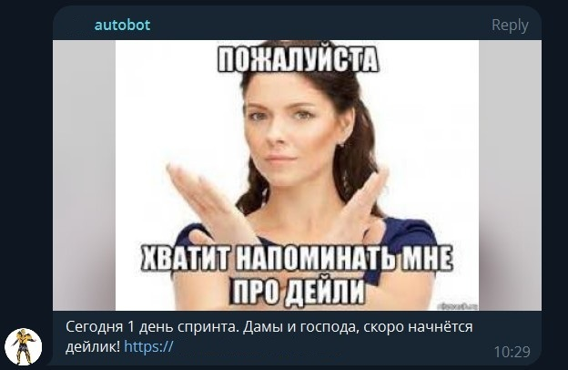
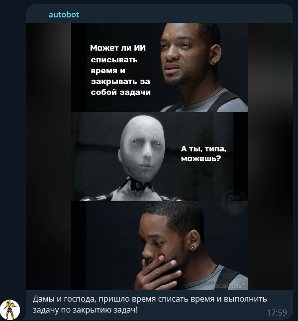
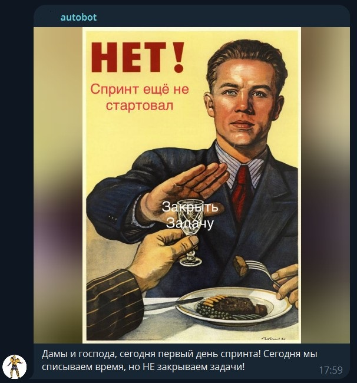
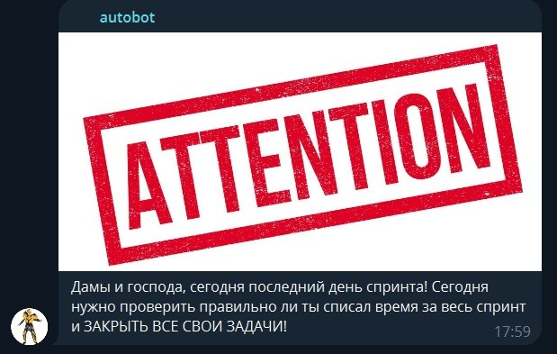
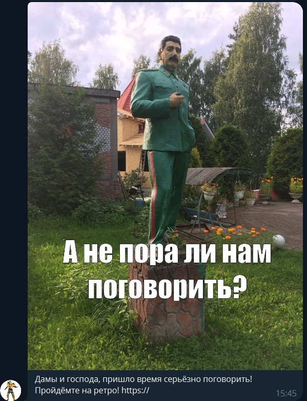

# Телеграмм бот - «Автобот»
Автобот создан для оповещения команд, работающих по SCRUM-методологии, о различных событиях в рамках спринта.
Главное, что есть у бота (и нет в этом репозитории) и из чего он появился - это большая база картинок-мемо-мотивашек.
Долгое время члены команды в роли scrum-мастера вручную отправляли мемы, чтобы утром собрать команду на дейли или напомнить о списании времени и закрытии задач (и повеселить).
Со временем появилась мысль, что слежением за временем и отправкой сообщений может заняться бот, а человекам останется только чистое творчество мемо-генерации. :-)

### Какие оповещения доступны в данный момент?
В данный момент есть оповещения для которых предусмотренны картинки (ради чего бот собственно и создавался):

* оповещение о начале дейлика / daily meeting. *Помимо самого призыва, включает информацию о том, какой сегодня день спринта, и ссылку на комнату созвона.*\
    

* оповещение о необходимости списать затраченное на задачи время и закрыть выполненные задачи. *Для первого и последнего дней спринта текстовки напоминания отличаются от стантартной.*\
    
    
    

* оповещение о начале ретро.\
    
    
Также можно добавить сообщения произвольной формы, которые будут присылаться в группу ежедневно или один раз в спринт(неделю, месяц).

### Как настроить оповещения Автобота у себя в командном чате?
У Автобота пока нет никакого интерфейса для добавления оповещений. Все изменения в базу разработчик вносит сам.

0. Связаться с разработчиком бота. ( Думаю, если вы читаете этот README, то этот пункт пройден :-) )
1. Нужно добавить Автобота к себе в командный чат и написать команду /contact. ( В этот момент разработчик получит id вашей группы )
2. Написать разработчику какие оповещения вы хотите получать. Формат описания может быть такой:
- **Событие:** "Дейли" "Закрытие тасок" "Ретро" или что-то своё "Ежедневный сбор команды на чаепитие". Если "своё", то просто не будет картинок.
- **Регулярность:** "Ежедневно" "Раз в спринт" "Раз в неделю" "Раз в месяц".
- **Время:** 16:30
- **Ссылка на комнату:** Если событие требует ссылки на комнату созвона.
- **С картинкой или без:** По умолчанию такие события, как "Дейли" "Таски" "Ретко", идут с картинкой, но если вам это не нужно, то вы можете написать "Без картинки".

